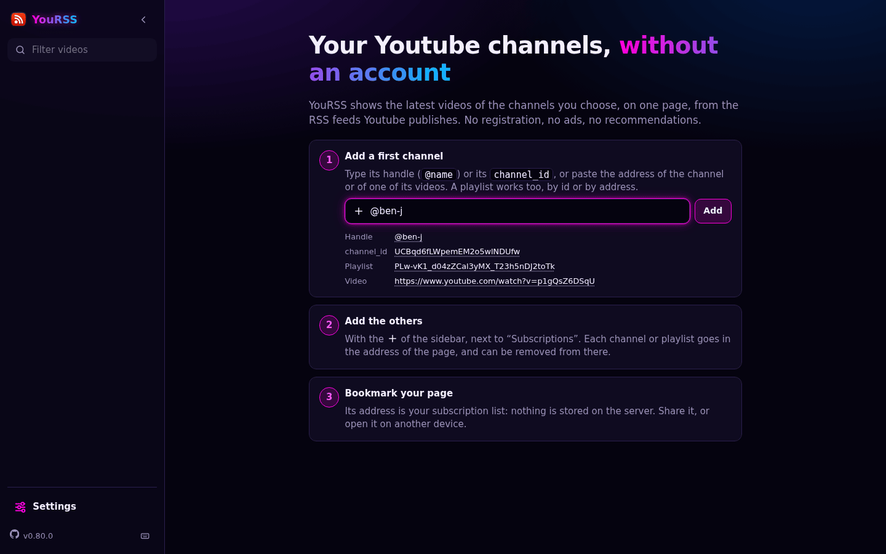
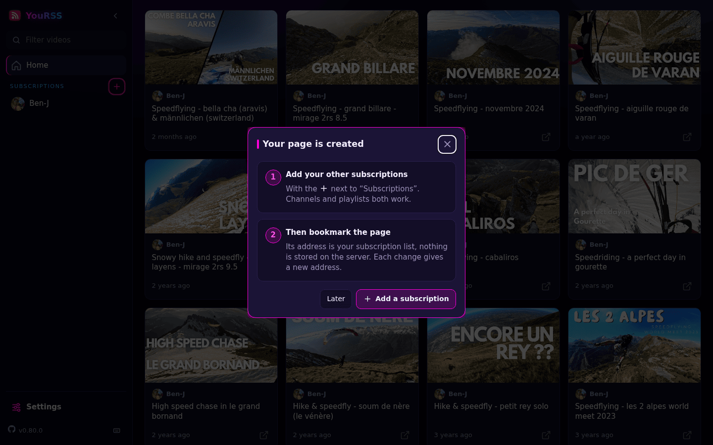
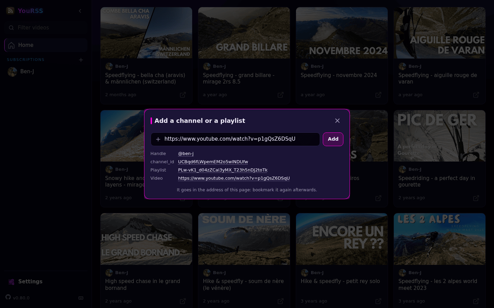

# YouRSS

> A minimal Youtube RSS feed viewer for your browser: the latest videos of the channels you chose, on one page. No account, no registration, no ads, no recommendations, no tracking.


<details>
<summary>More screenshots</summary>

| The player takes the whole row | A channel, opened inside the page |
| --- | --- |
|  |  |

<p align="center">
  
  
</p>

</details>

## 🚀 Try the demo

**https://yourss.onrender.com**

> This demo is a public instance, shared by everyone and hosted on a free plan: it sleeps when nobody uses it, so the first page may take about a minute to show up. It comes without any guarantee and can be limited or stopped at any time: to follow your channels every day, [install your own](#-install).

## ✨ Features

### 🧱 Build your own page

No account: your subscriptions are the address of your page.

| 1. Start from the home page | 2. Your page is created | 3. Add the rest, then bookmark |
| --- | --- | --- |
|  |  |  |

- the home page takes your first channel, then the **+** next to *Subscriptions* adds the others
- a channel is added by its handle (`@name`), its *channel_id*, its address or the address of one of its videos; a playlist by its id or its address
- a subscription is removed from the sidebar
- each change gives a new address, made of ids only (example https://yourss.domain.tld/UCVooVnzQxPSTXTMzSi1s6uw,PLw-vK1_d04zZCal3yMX_T23h5nDJ2toTk): bookmark it, share it, open it on another device. Nothing is stored on the server

The administrator of an instance can also declare *user* pages, short names for a list of channels and playlists (`/u/<name>`), and can turn custom pages off.

### 📰 One page for all your subscriptions

A page shows the last 15 videos of each channel and what the feed of each playlist holds, sorted by date.

Turn on *Show new videos* in the settings and the videos you played for a few seconds are marked as watched: on the next visit a `NEW` marker and a counter per channel show what you have not seen yet, and an *All / New* switch hides the rest. This is stored in your browser only.

### ▶️ Play in the page

Click a thumbnail to play: the player takes the whole row, or the whole screen on a phone. A second action opens a fullscreen player with links to Youtube and to the RSS feed. The next video can be played automatically.

### 📺 Keep watching while you browse

Turn on the *Mini player* in the settings: when you scroll away, the video keeps playing, docked in a corner of the screen, while you browse the rest of the page or open another channel. Its card shows where it comes from, a click brings you back to it, and the mini player closes by itself when the video ends. Without it, the player is closed as soon as its card leaves the screen.

### 📂 Channels and playlists, inside the page

Click a channel in the sidebar to browse it without leaving your page: its recent videos, all its videos, its shorts and its streams. A playlist opens the same way.

### 🎁 And also

- three themes (neon, dark, light) and three density levels, to pick in the settings
- works on desktop and mobile, can be added to the home screen of a phone
- instant search in the titles
- keyboard shortcuts: arrows move in the grid, `Space` plays, `n`/`p` play the next/previous video, `Shift`+`↑`/`↓` change channel… press `?` for the list
- light: server-rendered pages, [htmx](https://htmx.org/), one CSS file and one JavaScript file, no framework

## 💡 Philosophy

Youtube publishes an RSS feed for every channel. RSS is an open and stable way to share content, it has been for decades: it lets *you* choose how, and with which application, you follow what you like.

*YouRSS* is a small RSS client for the browser, nothing more:

- **no account**: the channels you follow are in the *URL*, a page can be bookmarked and shared as is
- **nothing but the content you chose**: no ads, no suggested videos
- **nothing kept on the server**: no database, no session, no cookie; your settings and the videos you watched stay in your browser
- **straight from Youtube**: thumbnails, avatars and the player are loaded by your browser, the server never relays them

# 📦 Install

## 🐍 From the source

First, you need [uv](https://docs.astral.sh/uv/), see [installation documentation](https://docs.astral.sh/uv/getting-started/installation/):

```sh
$ git clone https://github.com/essembeh/YouRSS
$ cd YouRSS
$ uv sync
$ uv run --env-file .env -- fastapi dev src/yourss/main.py

# or if you use just
$ just run
```

Then visit [http://localhost:8000/](http://localhost:8000/)

## 🐳 From docker

Using Docker you can run the latest image build on the latest commit:

```sh
$ docker run -d --name yourss -p 8000:8000 ghcr.io/essembeh/yourss:main
```

Then visit [http://localhost:8000/](http://localhost:8000/)

## ☸️ Install Helm Chart for Kubernetes

You need an access to a Kubernetes cluster and `helm` tool installed.
```sh
# add the helm repository
$ helm repo add yourss https://essembeh.github.io/YouRSS/ 
# get the values.yaml
$ helm show values yourss/yourss > myvalues.yaml
# edit the values for your needs
$ vim myvalues.yaml
# install release
$ helm install my-yourss yourss/yourss -f myvalues.yaml
```

> Note: you need to add an *Ingress* to access the *Service* from outside your cluster.

You can then forward the service to test it:

```sh
$ kubectl port-forward service/my-yourss 8000:http
```

Then visit [http://localhost:8000/](http://localhost:8000/)

# ⚙️ Configuration

*YouRSS* can be configured using environment variables.

| VARIABLE | DEFAULT | HELM VALUE | DESCRIPTION |
|----------|---------|------------|-------------|
| YOURSS_CUSTOM_PAGES_ENABLED | `True` | `yourss.customPagesEnabled` | Let visitors build their own page by putting channels in its URL. If set to `false`, the home page and the multi channel pages show an error (`403`), and only the *user* pages remain |
| YOURSS_MAX_PAGE_ITEMS | `12` | `yourss.maxPageItems` | How many channels and playlists the address of a custom page may hold. A longer address is refused (`422`) before anything is asked to Youtube. *User* pages are not limited |
| YOURSS_API_DOCS_ENABLED | `False` | `yourss.apiDocsEnabled` | If set to `true`, the generated API documentation is served at `/docs`, `/redoc` and `/openapi.json`. Meant for development: it is off in the docker image and in the Helm chart |
| YOURSS_USERS_FILE |  | `yourss.users` | You can declare user pages in a dedicated file (the Helm chart builds it from the values and stores it in a *Secret*) |
| YOURSS_CLEAN_TITLES | `False` | `yourss.cleanTitles` | If set to `true`, videos titles are cleaned to prevent UPPERCASE TITLES |
| YOURSS_CACHE_FOLDER |  | `yourss.cacheEnabled` | If set, the last successful RSS response is stored on disk in this folder (created at startup) to survive Youtube's daily transient `404` windows. Feeds are **always** fetched live; this is a fallback, not a cache. If unset, a `404` is propagated as-is |
| YOURSS_CACHE_MAX_AGE | `PT24H` | `yourss.cacheMaxAge` | Max age of the fallback file served when Youtube returns a `404` (ISO-8601 duration, e.g. `PT24H`, or a number of seconds). Older files are deleted and the `404` is propagated |
| YOURSS_CHANNEL_CACHE_TTL | `PT1H` | `yourss.channelCacheTtl` | How long the name and avatar of a channel are kept in memory (ISO-8601 duration or seconds, `0` disables). Only these few strings are cached, at most 1024 channels; feeds and video lists are always fetched live |

> Note: in the users file, a channel is a *channel_id* (24 characters, like `UCa_Dlwrwv3ktrhCy91HpVRw`) or a handle (like `@JonnyGiger`), and a playlist is its id (`PL…`). The address of a page only holds ids.

See [`.env`](./.env) for example.

## 👤 Configure user pages

You can create *user* pages with as many *channels* as you want, *user* pages are easier to type or remember.
For example you can have http://my-yourss-instance/u/skate with some *channels* configured instead of bookmarking http://my-yourss-instance/UCVooVnzQxPSTXTMzSi1s6uw,UCQsmxaMzYr76Yd1iqMEq8TA 

To configure users:
- set `YOURSS_USERS_FILE` and point to a *YAML* file where you'll declare your *users*
- see [sample `users.yaml`](./samples/users.yaml) for example
- *user* page can be protected by a *password* (configurable using plain text passwords or argon2 hash)

## 🚫 Disable custom pages

By default any visitor can build a page by putting channels in its URL, and the home page explains how.
The administrator of an instance can turn this off, for example to keep the instance for the *user* pages declared in the configuration:

- set `YOURSS_CUSTOM_PAGES_ENABLED=false`, or `yourss.customPagesEnabled: false` in the Helm values
- the home page and the multi channel pages (`/UCVooVnzQxPSTXTMzSi1s6uw,UCQsmxaMzYr76Yd1iqMEq8TA`) then show an error (`403`), and channels can no longer be added
- the *user* pages (`/u/<name>`) keep working

> Note: this does not make the instance private, the routes which feed the pages (`/htmx/...`) still answer for any channel.

# 📖 Usage

- the home page `http://yourss.local/` explains how to build your own page and lets you add your first channel
- you can browse a single channel with: `http://yourss.local/UCVooVnzQxPSTXTMzSi1s6uw`
- you can browse multiple channels and playlists in a single page, their ids separated by commas: `http://yourss.local/UCVooVnzQxPSTXTMzSi1s6uw,UCQsmxaMzYr76Yd1iqMEq8TA`
- an address only holds ids: to add a channel by its handle (`@jonnygiger`) or its address, use the add form, which resolves it
- click a channel in the sidebar of a page to browse its homepage (recent videos, videos, shorts, streams)
- if you defined some *users*, for example `demo`, the page can be accessed at `http://yourss.local/u/demo`

> Note: replace `yourss.local` with the URL of your *YouRSS* instance.

# 🔗 External links

Special thanks to the amazing python frameworks: [FastAPI](https://fastapi.tiangolo.com/), [asyncio](https://docs.python.org/fr/3/library/asyncio.html), [httpx](https://www.python-httpx.org/) and [Pydantic](https://docs.pydantic.dev/) ♥️


- Youtube player API: https://developers.google.com/youtube/player_parameters
