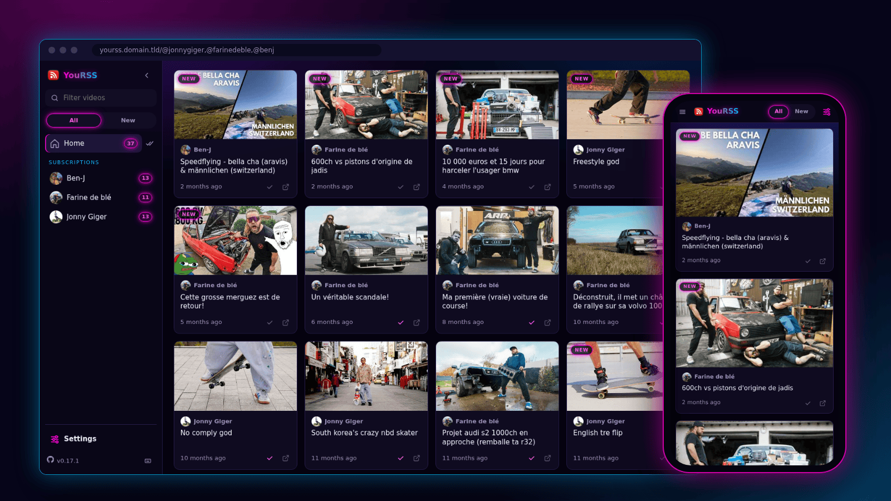
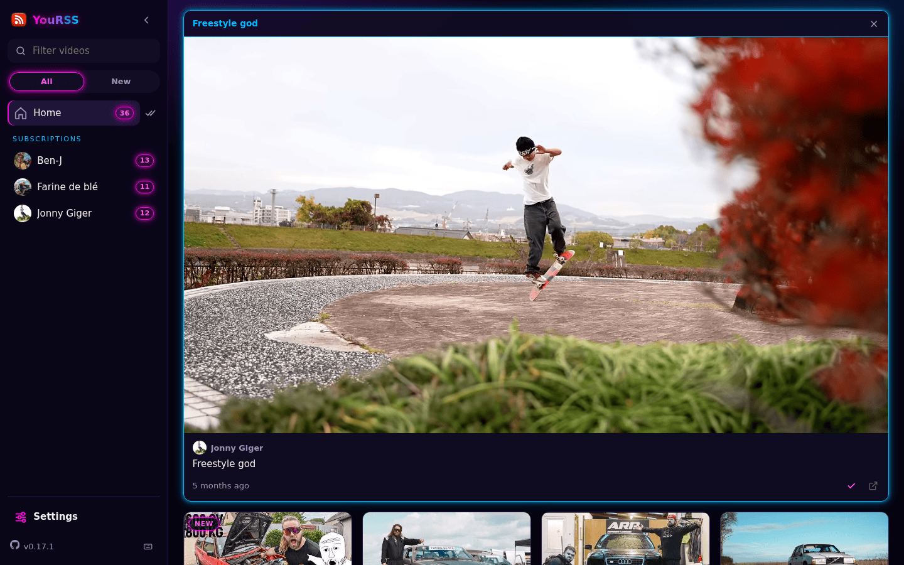
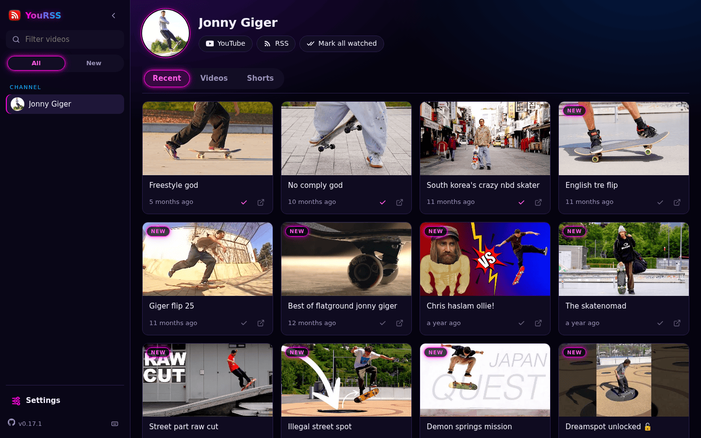
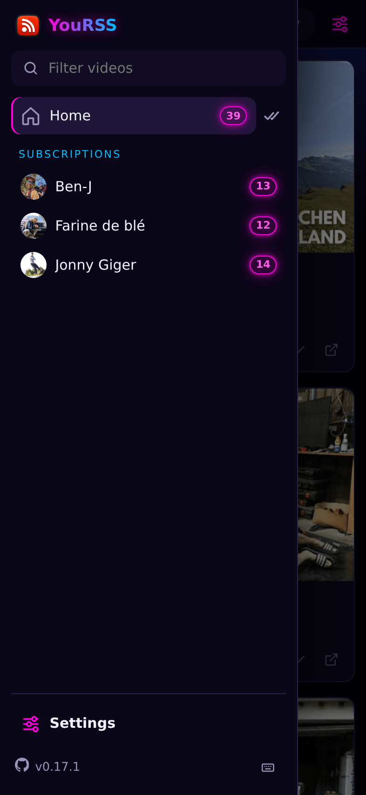
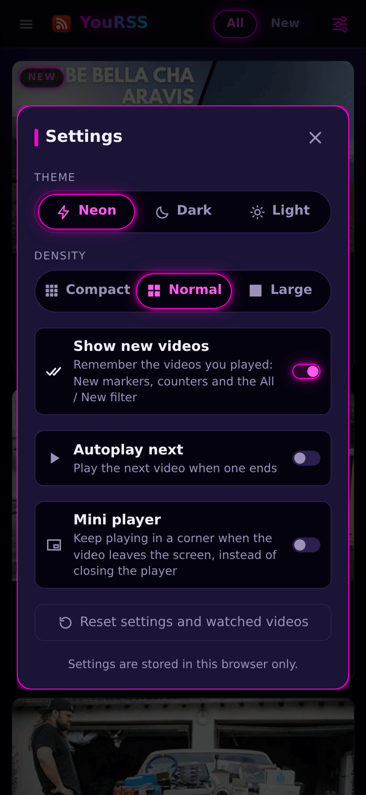

# YouRSS

> A minimal Youtube RSS feed viewer for your browser: the latest videos of the channels you chose, on one page. No account, no registration, no ads, no recommendations, no tracking.



<details>
<summary>More screenshots</summary>

| The player takes the whole row | The homepage of a channel |
| --- | --- |
|  |  |

<p align="center">
  
  
</p>

</details>

## Why

Youtube publishes an RSS feed for every channel. RSS is an open and stable way to share content, it has been for decades: it lets *you* choose how, and with which application, you follow what you like.

*YouRSS* is a small RSS client for the browser, nothing more:

- **no account**: the channels you follow are in the *URL*, a page can be bookmarked and shared as is
- **nothing but the content you chose**: no ads, no suggested videos
- **nothing kept on the server**: no database, no session, no cookie; your settings and the videos you watched stay in your browser
- **straight from Youtube**: thumbnails, avatars and the player are loaded by your browser, the server never relays them

## Features

### One page for all your channels

Add the channels you like to the URL (example https://yourss.domain.tld/@jonnygiger,@berrics) and get their last 15 videos, sorted by date. A *user* page gives a short name to a list of channels.

Turn on *Show new videos* in the settings and the videos you played for a few seconds are marked as watched: on the next visit a `NEW` marker and a counter per channel show what you have not seen yet. This is stored in your browser only.

### Play in the page

Click a thumbnail to play: the player takes the whole row, or the whole screen on a phone. When you scroll away the player is closed, or keeps playing in a mini player if you turned it on in the settings. A second action opens a fullscreen player with links to Youtube and to the RSS feed. The next video can be played automatically.

### Channel pages

Browse the homepage of a channel with its recent videos, all its videos, its shorts and its streams.

### And also

- three themes (neon, dark, light) and three density levels, to pick in the settings
- works on desktop and mobile, can be added to the home screen of a phone
- instant search in the titles
- keyboard shortcuts: arrows move in the grid, `Space` plays, `n`/`p` play the next/previous video, `Shift`+`↑`/`↓` change channel… press `?` for the list
- light: server-rendered pages, [htmx](https://htmx.org/), one CSS file and one JavaScript file, no framework

# Install

## From the source

First, you need [uv](https://docs.astral.sh/uv/), see [installation documentation](https://docs.astral.sh/uv/getting-started/installation/):

```sh
$ git clone https://github.com/essembeh/YouRSS
$ cd YouRSS
$ uv sync
$ uv run --env-file .env -- fastapi dev src/yourss/main.py

# or if you use just
$ just run
```

Then visit [http://localhost:8000/](http://localhost:8000/)

## From docker

Using Docker you can run the latest image build on the latest commit:

```sh
$ docker run -d --name yourss -p 8000:8000 ghcr.io/essembeh/yourss:main
```

Then visit [http://localhost:8000/](http://localhost:8000/)

## Install Helm Chart for Kubernetes

You need an access to a Kubernetes cluster and `helm` tool installed.
```sh
# add the helm repository
$ helm repo add yourss https://essembeh.github.io/YouRSS/ 
# get the values.yaml
$ helm show values yourss/yourss > myvalues.yaml
# edit the values for your needs
$ vim myvalues.yaml
# install release
$ helm install my-yourss yourss/yourss -f myvalues.yaml
```

> Note: you need to add an *Ingress* to access the *Service* from outside your cluster.

You can then forward the service to test it:

```sh
$ kubectl port-forward service/my-yourss 8000:http
```

Then visit [http://localhost:8000/](http://localhost:8000/)

# Configuration

*YouRSS* can be configured using environment variables.

| VARIABLE | DEFAULT | HELM VALUE | DESCRIPTION |
|----------|---------|------------|-------------|
| YOURSS_DEFAULT_CHANNELS | `@JonnyGiger` | `yourss.defaultChannels` | Channels of the home page, you can set multiple channels using `,` as separator (a list in the Helm values) |
| YOURSS_API_DOCS_ENABLED | `False` | `yourss.apiDocsEnabled` | If set to `true`, the generated API documentation is served at `/docs`, `/redoc` and `/openapi.json`. Meant for development: it is off in the docker image and in the Helm chart |
| YOURSS_USERS_FILE |  | `yourss.users` | You can declare user pages in a dedicated file (the Helm chart builds it from the values and stores it in a *Secret*) |
| YOURSS_CLEAN_TITLES | `False` | `yourss.cleanTitles` | If set to `true`, videos titles are cleaned to prevent UPPERCASE TITLES |
| YOURSS_CACHE_FOLDER |  | `yourss.cacheEnabled` | If set, the last successful RSS response is stored on disk in this folder (created at startup) to survive Youtube's daily transient `404` windows. Feeds are **always** fetched live; this is a fallback, not a cache. If unset, a `404` is propagated as-is |
| YOURSS_CACHE_MAX_AGE | `PT24H` | `yourss.cacheMaxAge` | Max age of the fallback file served when Youtube returns a `404` (ISO-8601 duration, e.g. `PT24H`, or a number of seconds). Older files are deleted and the `404` is propagated |
| YOURSS_CHANNEL_CACHE_TTL | `PT1H` | `yourss.channelCacheTtl` | How long the name and avatar of a channel are kept in memory (ISO-8601 duration or seconds, `0` disables). Only these few strings are cached, at most 1024 channels; feeds and video lists are always fetched live |

> Note: channels can be Youtube username (like `@JonnyGiger`) or directly a *channel_id* (24 alnum chars) like `UCa_Dlwrwv3ktrhCy91HpVRw`, to provide a list, use a coma between channels

See [`.env`](./.env) for example.

## Configure user pages

You can create *user* pages with as many *channels* as you want, *user* pages are easier to type or remember.
For example you can have http://my-yourss-instance/u/skate with some *channels* configured instead of bookmarking http://my-yourss-instance/@jonnygiger,@berrics 

To configure users:
- set `YOURSS_USERS_FILE` and point to a *YAML* file where you'll declare your *users*
- see [sample `users.yaml`](./samples/users.yaml) for example
- *user* page can be protected by a *password* (configurable using plain text passwords or argon2 hash)

# Usage

- you can browse a single channel with: `http://yourss.local/@jonnygiger`
- you can browse multiple channels in a single page: `http://yourss.local/@jonnygiger,@berrics`
- you can browse the homepage of a channel (recent videos, videos, shorts, streams): `http://yourss.local/c/@jonnygiger`
- the original *RSS* feed can be accessed at `http://yourss.local/proxy/rss/@jonnygiger`
- you will be redirected to the channel avatar with `http://yourss.local/proxy/avatar/@jonnygiger`
- if you defined some *users*, for example `demo`, the page can be accessed at `http://yourss.local/u/demo`

> Note: replace `yourss.local` with the URL of your *YouRSS* instance.

# External links

Special thanks to the amazing python frameworks: [FastAPI](https://fastapi.tiangolo.com/), [asyncio](https://docs.python.org/fr/3/library/asyncio.html), [httpx](https://www.python-httpx.org/) and [Pydantic](https://docs.pydantic.dev/) ♥️


- Youtube player API: https://developers.google.com/youtube/player_parameters
